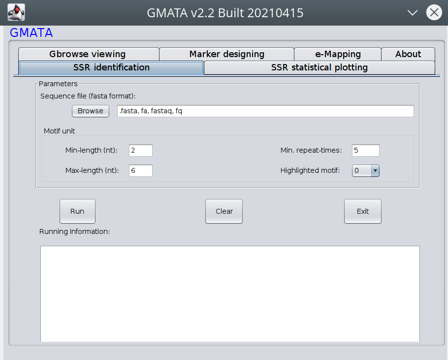

# GMATA
### GMATA stands for Genome-wide Microsatellite Analyzing Toward Application. GMATA is an easiest and fastest bioinformatic tool /software for any Simple Sequence Repeats (SSR) analyses, and SSR marker designing, polymorphism screen, and e-mapping in any DNA sequences. GMATA algorithm has been cited wordwide for more than 100 times. You can run the GMATA from graphic interface or command interface. Latest version: v2.2.1
## Install
 `git clone https://github.com/XuewenWangUGA/GMATA`

 `cd GMATA`
 
 For Linux, you may need to install additional dependency e-PCR.zip which is alvailable at [Sourceforge](https://sourceforge.net/projects/gmata/)
 
 For Windows, everthing is package so you don't need to install additional dependency. 
 
[more detailed installation steps](GMATA_installation.pdf)

## GMATA can be fully run at three ways:
1. run at the graphic interface: This is recommended for who do have programming skills. Only mouse click is needed for this method to run GMATA.
or
2. run all commands by a single step: This can run batchly and integrate into your pipeline. 
or
3. step by step command
 
 ## Run graphic interface
 `java -jar GMATA.jar`
 or double click the `GMATA#.jar`, where # is the version number, e.g. `GMATAV2.2.1.jar`

Then you will see the following interface

 
 ## Run command interface
 `perl gmata.pl -c default_cfg.txt -i ..\data\testseq.fasta`
 
  where -c parameter is for config file. More details and demonstration on [user manual](GMATA%manual_V2.01_20151218.pdf)
 File: GMATA%manual_V2.01_20151218.pdf
 
 ## Step by Step
 Please followed the steps in manual and demo.

## Updates on version 2.2.1
Updated the graphic interface. fixed the issue which may not start at particular version of Linux Ubuntu.

## Updates on version 2.2
1. add a new module for masking SSRs for genome annotation
2. add a new function for satelite analysing
3. add tools for mining SSRs in 2nd and 3rd genertation reads
4. new interface

## Main functions
This is the software GMATA at GitHUB
What is software GMATA v2.2 (latest)
Genome-wide Microsatellite Analyzing Toward Application (GMATA) is a software for Simple Sequence Repeats (SSR) analyses, and SSR marker designing and mapping in any DNA sequences. It has the following functions:
1. SSR mining; good for all SSRs:microsatellites, satellites, any tadem repeats
2. Statistical analysis and plotting;
3. SSR loci graphic viewing;
4. Marker designing;
5. ploymorphism screen;
6. Electronic mapping and marker transferability investigation.
GMATA is accurate, sensitive and fast. It was designed to process large genomic sequence data sets, especially large whole genome sequences. In theory, genomes of any size can be analyzed by GMATA easily. Software GMATA works on sever, desktop or even laptop, and it can run in graphic interface with just clicks or run in command line or in automated pipeline. It is also cross-platform and supports Unix/Linux, Win and Mac. Results from software GMATA can be directly graphically displayed with genome or gene features in Gbrowser and easily integrated with any genomic database.

## Citing this software:
GMATA: an integrated software package for genome-scale SSR mining, marker development and viewing
X Wang, L Wang
[Frontiers in Plant Science 7, doi 10.3389/fpls.2016.01350](http://journal.frontiersin.org/article/10.3389/fpls.2016.01350/full)

The software has been cited more than 160 times in published papers. To see which publication cited GMATA and GMATo, click here at [Xuewen Wang Google scholar page](https://scholar.google.com/citations?user=jXfdcm0AAAAJ&hl=en)

## Alternative downloading link for this software 
[Sourceforge](https://sourceforge.net/projects/gmata/)

## Features
Accurate and fastest SSR mining in any large sequences
Complete statistical analysis and plotting
SSR loci and marker graphic displaying in Gbrowser with genome features
Specific SSR marker designing, and simulated PCR
Electronic mapping, and marker transferability investigation

## Discussion
[sourceforge discussion](https://sourceforge.net/p/gmata/wiki/Home/)

## Testing data
To make a test run: go to web https://sourceforge.net/projects/gmata/files/?source=navbar 
to download the test data called "datav21.zip"
or download the "testseq.fasta" and then put a separately folder e.g. "data" instead of running in the source script, otherwise  all lots of results will write to the same directory. Of course, it will run well if you still want to keep running the analysis on "testseq.fasta"" in the installed software directory.
